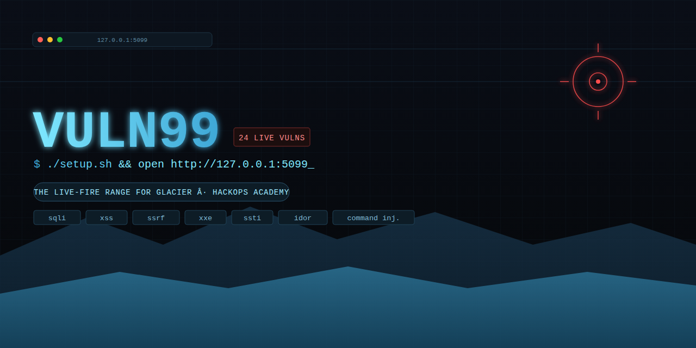

<p align="center">
  
</p>

# Vuln99 — Merged Vulnerable Training Storefront

Vuln99 merges two prior HackOps Academy projects into one app:

- **Glacier's `vulnerable_test_app.py`** — a lean Flask testbed with detection
  signatures purpose-built to match [Glacier's](https://github.com/hackops-academy/glacier) active scanner (`active/scanner.py`):
  reflected XSS, error-based SQLi, boolean-blind SQLi, time-blind SQLi,
  path traversal, command injection (reflected + blind), and open redirect
  all use the *exact same route paths, parameter names, and error-message
  format* Glacier's `check_*` functions already look for.
- **VulnMart** — a fuller e-commerce app (users, cart, orders, reviews,
  admin panel) with a per-page difficulty system (low/medium/hard).

Vuln99 keeps Glacier's scanner-compatible signatures, VulnMart's realistic
storefront breadth, and generalizes the difficulty system to be **per
vulnerability** (24 of them) rather than per page, configurable live from
an in-app admin settings screen.

**📖 Learn Vuln99 like a professional:** the full course is live at
**[hackops-academy.github.io/vuln99](https://hackops-academy.github.io/vuln99/)**
— 13 modules mapping all 24 vulnerabilities to specific Glacier commands,
plus a full combined Glacier × Vuln99 methodology. It's the companion to
**[Glacier's own course](https://hackops-academy.github.io/glacier/)** — read
them together.

---

## ⚠️ Before you install

This app contains **real, working** SQL injection, OS command injection,
XXE, SSRF, SSTI, and insecure deserialization. It binds to `127.0.0.1`
(localhost) by default, and should stay that way unless you're on an
isolated lab VM with no route to the internet or a shared/corporate
network. See [Network binding](#network-binding-for-scanners--packet-capture)
below before you ever change that.

---

## 📥 Download & Setup

### 1. Requirements

- **Python 3.9+**
- `pip` and `venv` (both ship with a standard Python install)
- macOS, Linux, or Windows (PowerShell)

### 2. Clone the repository

```bash
git clone https://github.com/hackops-academy/vuln99.git
cd vuln99
```

### 3. Install & run

The fastest path is the setup script — it creates a venv, installs
dependencies, and starts the app in one command:

```bash
./setup.sh                 # macOS / Linux
```
```powershell
.\setup.ps1                # Windows PowerShell
```

Or set it up by hand, if you'd rather see each step:

```bash
python3 -m venv venv
source venv/bin/activate      # Windows: venv\Scripts\activate
pip install -r requirements.txt
python run.py
```

### 4. Open it

Go to **http://127.0.0.1:5099** in your browser.

The database is SQLite and **reseeds from scratch every time the process
starts** — every launch boots into the same known, clean state, so you
never have to manually reset it between practice sessions.

### 5. (Optional) Verify the install

A pytest smoke suite boots the app and hits every route at every
difficulty tier to catch a broken install before you blame the scanner
for a bad target:

```bash
./setup.sh --test          # macOS/Linux
.\setup.ps1 -Test          # Windows
# or, with the venv already active:
pip install -r requirements-dev.txt
pytest -q
```

This does **not** verify the vulnerabilities themselves — that's the
app's whole point — just that nothing 500s.

---

## Test accounts

| Username     | Password      | Role  |
|--------------|---------------|-------|
| admin        | admin123      | admin |
| john_doe     | password123   | user  |
| alice_smith  | password123   | user  |
| bob_jones    | password123   | user  |

## Difficulty levels

Every vulnerability can be set independently via **Admin → Difficulty
settings** (`/admin/settings`) — including bulk "set all to low/medium/hard"
buttons — or by editing rows directly in the `settings` table:

- **low** — fully vulnerable, no mitigation (Glacier's scanner is tuned
  to detect these).
- **medium** — a partial, commonly-seen-in-the-wild mitigation that's
  still bypassable (blacklist filtering, naive escaping, rate-limiting
  mistaken for access control, etc.) — good for practicing filter/WAF
  bypass techniques. Every one of the 24 vulns has a *genuinely*
  bypassable medium tier — see `VULNERABILITIES.md` for exact payloads.
- **hard** — the properly fixed version (parameterized queries,
  allow-lists, real session-based auth checks, CSP-safe output encoding).

To reach the admin panel/settings without a valid login when
`broken_admin` is set to **low**, visit `/admin/become-admin-demo` (sets
the forgeable `is_admin` cookie the low-difficulty check trusts).

## Vulnerability catalog (24)

For attack payloads and step-by-step walkthroughs for every row below, see
**[`VULNERABILITIES.md`](VULNERABILITIES.md)**.

| Key | Vulnerability | Where |
|---|---|---|
| `login_sqli` | SQL injection auth bypass | `/login` |
| `search_sqli` | UNION-based SQL injection | `/search` |
| `product_sqli` | Error-based SQL injection | `/product` |
| `blind_sqli_bool` | Boolean-blind SQL injection | `/blind-product` |
| `blind_sqli_time` | Time-blind SQL injection | `/slow-product` |
| `recommend_sqli` | Cookie-based SQL injection | `/recommend` |
| `header_sqli` | HTTP header SQL injection | `/category` (sink: `/admin/logs`) |
| `reflected_xss` | Reflected XSS | `/search` |
| `stored_xss` | Stored XSS | product reviews (`/product`, `/reviews`) |
| `csrf` | CSRF | `/checkout` |
| `idor_orders` | IDOR | `/orders`, `/account?id=` |
| `broken_admin` | Broken access control | `/admin`, `/admin/settings` |
| `mass_assignment` | Mass assignment | `/account` (POST) |
| `price_tamper` | Business-logic / client-trusted price | `/cart` |
| `path_traversal` | Path traversal / LFI | `/read-file` |
| `file_upload` | Unrestricted file upload | `/account/avatar` |
| `command_injection` | OS command injection | `/ping`, `/ping-slow` |
| `open_redirect` | Open redirect | `/go` |
| `ssrf` | Server-Side Request Forgery | `/admin/import-image` |
| `xxe` | XML External Entity injection | `/admin/import-orders` |
| `insecure_deserialization` | Insecure deserialization (pickle) | "Remember me" on `/login` |
| `ssti` | Server-Side Template Injection | `/admin/email-preview` |
| `weak_crypto` | Weak password hashing (unsalted MD5) | `/register` |
| `verbose_errors` | Verbose errors / info disclosure | `/product`, `/version` |

Every vulnerable route has a `/safe-*` sibling where one exists
(`/safe-search`, `/safe-product`, `/safe-read-file`, `/safe-ping`,
`/safe-go`) showing the correctly-guarded implementation side by side —
useful for confirming a scanner correctly stays quiet on hardened
endpoints.

## Admin panel

`/admin` shows live stats (users, orders, reviews, activity-log
entries, and a low/medium/hard breakdown of every vuln's current
setting) plus quick links to:

- **Difficulty settings** (`/admin/settings`) — per-vuln control + bulk
  set-all buttons.
- **Activity logs** (`/admin/logs`) — the sink for `header_sqli`: shows
  the last 100 page visits, including raw `User-Agent`/`X-Forwarded-For`
  values, exactly as they were written to the database.
- The existing SSRF/XXE/SSTI admin-only lab tools.

## Configuration

All runtime config is environment-driven (see `vuln99/config.py`), with
safe defaults if you don't set anything:

| Variable | Default | Purpose |
|---|---|---|
| `VULN99_HOST` | `127.0.0.1` | Bind address |
| `VULN99_PORT` | `5099` | Bind port |
| `VULN99_DEBUG` | on iff host is localhost | Flask debug/reloader |
| `VULN99_SECRET_KEY` | dev default | Flask session signing key |
| `VULN99_LOG_DIR` | `./logs` | Where access/event logs are written |
| `VULN99_LOG_LEVEL` | `INFO` | Log verbosity |

### Network binding for scanners / packet capture

By default vuln99 only listens on `127.0.0.1`. If you're running it in
an isolated lab VM or private lab network and want to point real tools
(nmap, Wireshark, Burp, a scanner running on a *different* VM in the
same isolated network) at it, override the bind address:

```bash
VULN99_HOST=0.0.0.0 VULN99_PORT=5099 python run.py
```

`run.py` will print a warning banner whenever it's bound to anything
other than localhost, as a reminder that this is now reachable from
elsewhere on that network. **Only do this on a host that has no route to
the internet or a shared/corporate network** — this app has real,
working exploits with no additional sandboxing.

Since vuln99 is a normal HTTP service, it doesn't need anything special
to be scanned/sniffed once it's reachable — `nmap -sV -p 5099 <host>`
will fingerprint it as a normal Werkzeug/Flask dev server, and any
packet capture on that interface will see plain HTTP traffic you can
correlate against `logs/access.log`.

## Logging

Every request is logged to `logs/access.log` (method, path, status,
response time, source IP, user-agent) and admin actions (difficulty
changes, bulk resets) go to `logs/events.log` — both rotate at ~2MB.
Handy for lining up what the app saw against a simultaneous nmap scan or
Wireshark capture during a class or CTF run.

## Project layout

```
run.py                     entry point
setup.sh / setup.ps1       one-command install + run (+ --test)
requirements.txt           runtime deps
requirements-dev.txt        + pytest
VULNERABILITIES.md          per-vuln attack payload reference
tests/
  test_smoke.py             route/difficulty-tier smoke suite
vuln99/
  __init__.py               app factory, blueprint registration, logging setup
  config.py                  env-driven host/port/debug/secret/log config
  logging_setup.py           access + event logging (logs/access.log, logs/events.log)
  db.py                      SQLite connection + schema
  seed.py                    reseeds users/products/reviews/orders/logs on boot
  difficulty.py              vulnerability catalog (24) + get/set difficulty
  chrome.py                  shared page shell (nav/footer/CSS)
  helpers.py                 session helpers + IDOR enumeration guard
  sample_files/               documents for the path-traversal lab
  routes/                     one file per feature area — see repo for full list
```

## Using with Glacier

Point [Glacier's](https://hackops-academy.github.io/glacier/) active
scanner at `http://127.0.0.1:5099/` with the `broken_admin`/injection-family
vulnerabilities set to **low** (the default) — the route paths, parameter
names (`username`/`password`, `q`, `id`, `file`, `host`, `url`), and SQL
error format (`sqlite3.OperationalError`) match what `active/scanner.py`'s
`check_*` functions already expect, so existing Glacier scans against the
old `vulnerable_test_app.py` continue to work unmodified against Vuln99.

For the full walkthrough — every one of the 24 vulnerabilities mapped to
a specific Glacier module, plus a combined methodology — see
**[Vuln99's course](https://hackops-academy.github.io/vuln99/)**, written
as the companion to [Glacier's course](https://hackops-academy.github.io/glacier/).

## License

MIT License — see `LICENSE` for details.

---

*Built by HackOps Academy — the live-fire range for [Glacier](https://github.com/hackops-academy/glacier).*
